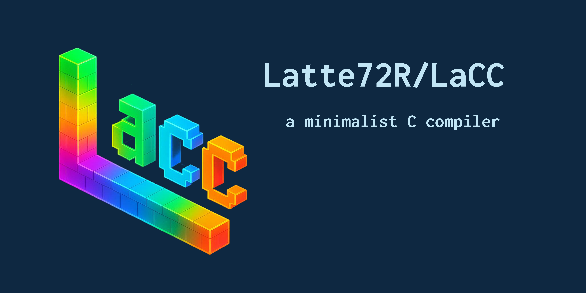

LaCC is a minimalist C compiler that implements only the core language features you need to get simple C programs running.

[![DeepWiki](https://img.shields.io/badge/DeepWiki-Latte72R%2FLaCC-blue.svg?logo=)](https://deepwiki.com/Latte72R/LaCC)

## Supported Features

### 1. Data Types

- **Primitive**: `int`, `char`, `void`  
- **Derived**: pointer types (`T*`), arrays (`T[]`)  
- **Composite**: structures (`struct`), enumerations (`enum`)  

### 2. Functions

- **Definition**: specify parameter and return types  
- **Declaration & Invocation**: define and call functions; use `return` to send back a value

### 3. Global & Local Variables

Both global and local (stack) variable declarations are supported.

### 4. Control Flow

- **Conditional Branching**  
  - `if (condition) { … }`  
  - `else { … }`  
- **Loops**  
  - `for (init; condition; step) { … }`  
    You can omit any or all of the three components of a for loop          (initialization, condition, and step).
  - `while (condition) { … }`  
  - `do { … } while (condition);` 
- **Loop Control**  
  - `break` exits a loop  
  - `continue` skips to the next iteration

### 5. Operators

* **Arithmetic**: `+`, `-`, `*`, `/`, `%`
* **Relational**: `==`, `!=`, `<`, `<=`, `>`, `>=`
* **Logical**: `&&`, `||`, `!`
* **Bitwise**: `&`, `|`, `^`, `~`, `<<`, `>>`

### 6. Others

- **Include directive** (with limitations)  
  LaCC can process `#include` statements with double quotes like `#include "lacc.h"`, 
  but it does not support the standard library headers like `<stdio.h>` in the traditional sense.

- **Initializer lists for arrays** (with limitations)  
  1. **Array initialization with a list of values:**  
     `int arr[3] = {3, 6, 2};`
  2. **String literal initialization for character arrays:**  
     `char str[15] = "Hello, World!\n";`  
  
  The initializer list can **only** contain numeric literals, 
  and there's **no** support for nested initializer lists.

- **Extern declarations**  
  LaCC supports external variable declarations with basic types, pointers, and arrays.

- **Typedef support**  
  LaCC supports the `typedef` keyword for creating type aliases.

- **Struct member access**  
  Both dot notation (`.`) for direct struct access and arrow notation (`->`) for pointer-to-struct access are supported.

- **Binary and Hexadecimal numbers:** `0b001011` or `0xFF2A`

- **Comment support**
  ```c
  // single-line comment
  /* multi-line
     comment */
  ```

## Unsupported Constructs

LaCC does **not** support the following:

- Nested functions (functions defined within other functions)  
- `switch` statements and `case` / `default` labels  
- `goto` statement and labels
- Ternary conditional operator (`?:`)  
- `union` types  
- Extended primitive types: `unsigned`, `long`, `float`, `double`, etc.  
- Type qualifiers & storage-class specifiers: `const`, `volatile`, `static`, `register`, `auto`, etc.  
- No initializer lists for structs (e.g.,  `struct AB p = {.a = 1, .b = 2};`)  
- Inline assembly  
- Preprocessor directives: `#define`, `#ifdef`, etc.  
- Variadic functions (functions with `...` parameters)  
- The comma operator
- Function pointers
- Explicit type casting
- Variable Length Arrays (VLAs)


## Limitations

### Single‐Unit Compilation
LaCC only handles one .c file at a time — there's no support for separate compilation or linking multiple translation units.

### No Optimizations
There are no code-generation optimizations beyond what's needed to make it work.


## Getting Started with LaCC

### 1. Clone the repository and enter it

  ```bash
  git clone https://github.com/Latte72R/LaCC
  cd LaCC
  ```

  After that, you have a few `make` targets to build and test your compiler:

### 2. Build the compiler

  ```bash
  make
  ```

  This invokes the default target, compiling all sources into the `lacc` executable.   
  If nothing has changed, you'll see

  ```bash
  'lacc' is up to date.
  ```

### 3. Build the self-hosted compiler

  ```bash
  make laccs
  ```

  Here, `lacc` is used to recompile the compiler source itself, producing a second-stage compiler named `laccs`.  
  This ensures that your compiler can correctly compile its own code.  

### 4. Run primary tests

  ```bash
  make test
  ```

  Similarly, this runs

  ```bash
  ./multitest.sh ./lacc
  ```

  to validate the first-stage compiler `lacc` against the same test suite.

### 5. Run self-host tests

  ```bash
  make selfhost-test
  ```

  Internally this runs

  ```bash
  ./multitest.sh ./laccs
  ```

  and executes a suite of example programs (unit tests, `prime.c`, `fizzbuzz.c`, etc.) using `laccs`.  
  Passing all tests confirms that your self-hosted compiler behaves as expected.  

### 6. Clean up build artifacts

  ```bash
  make clean
  ```

  Removes the `lacc` and `laccs` binaries, object files (`*.o`), assembly files (`*.s`) and any temporary files (`tmp*`), letting you start from a clean slate.


## About the Author  
LaCC is designed and maintained by student engineer **Latte72** !  

### Links  
- **Website:** [https://latte72.net/](https://latte72.net/)
- **GitHub:** [@Latte72R](https://github.com/Latte72R/LaCC)
- **X a.k.a Twitter:** [@Latte72R](https://twitter.com/Latte72R)
- **Qiita:** [@Latte72R](https://qiita.com/Latte72R)
